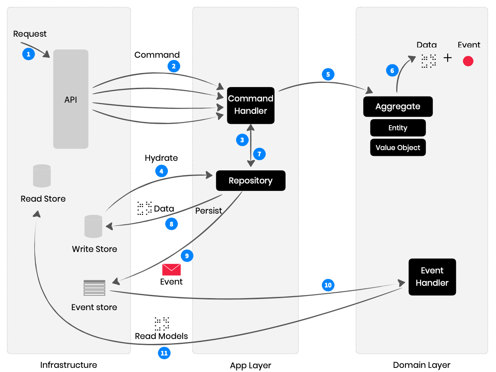

# CQRS

CQRS separates the responsibilities of reading and writing data, allowing for
optimized and scalable operations by using different models for command (write)
and query (read) actions.

## Elements

| Element | Layer | Purpose  |
| ------- | ----- | -------  |
| Application Service | Application | Orchestrates business operations by coordinating between the domain logic and infrastructure components. |
| Commands | Application | Imperative messages that request a specific action or change in the system, typically altering the state of the application or domain. |
| Command Handlers | Application | Components responsible for executing the business logic associated with a specific command, processing the command to perform the required action or state change. |
| Aggregates | Domain | A cluster of domain entities that are treated as a single unit, ensuring consistency and encapsulating business logic. |
| Events | Domain | A record of a significant change in state or behavior within the domain, which can trigger subsequent processing. |
| Event Handlers | Domain | A component that listens for specific events and executes business logic in response to those events. |
| Repository | Application | A data access layer that provides an abstraction for retrieving and persisting domain objects, ensuring that domain logic remains isolated from data storage concerns. |
| Persistence Store | Infrastructure | A general-purpose storage system that holds the application's data, typically used for saving the current state of domain objects outside of event-driven contexts. |
| Event Store | Infrastructure | A specialized storage system that captures and persists all domain events, allowing the reconstruction of aggregate states and enabling event sourcing patterns. |

## Workflow

1. **Request**: A client request is made to the system, which is received by the API layer.
2. **Command**: The API converts the request data into a Command, which is passed to the Command Handler for processing.
3. **Command Handler**: The Command Handler receives the Command and is responsible for executing the associated business logic. It interacts with the Repository to obtain the necessary Aggregate.
4. **Repository**: The Repository retrieves the Aggregate by hydrating it from the Persistence Store (Write Store) based on the current state.
5. **Aggregate**: The Command Handler invokes the relevant behavior on the Aggregate, passing the data from the Command to perform a business operation.
6. **Output**: The Aggregate processes the data and, if successful, generates an event as a result of a state change or a business operation.
7. **Repository**: The Command Handler persists the updated Aggregate and any resulting events back through the Repository.
8. **Persistence**: The Repository saves the updated data back into the Write Store.
9. **Event Store**: Any events generated by the Aggregate are also stored in the Event Store for subsequent processing.
10. **Event Handler**: The stored events are processed by the Event Handler, which reacts to specific events by triggering further actions or updating read models.
11. **Read Models**: The Event Handler updates the Read Store with new or modified Read Models that are optimized for query operations.
