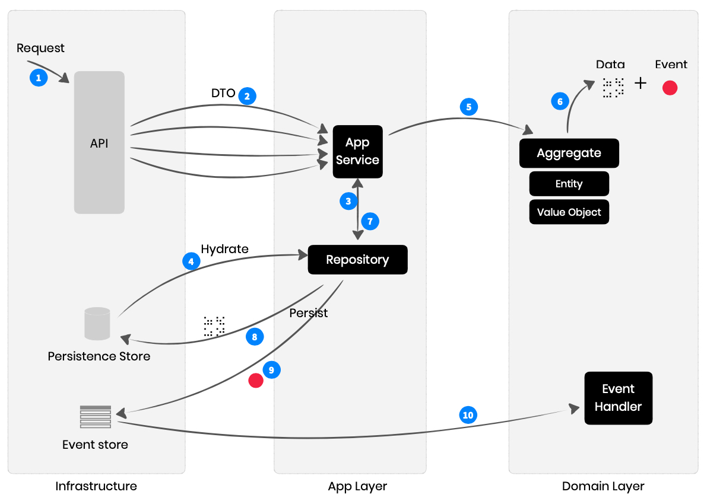

# DDD

In this pattern, you use only the tactical elements that are part of core DDD.

## Elements

| Element | Layer | Purpose  |
| ------- | ----- | -------  |
| Application Service | Application | Orchestrates business operations by coordinating between the domain logic and infrastructure components. |
| Aggregates | Domain | A cluster of domain entities that are treated as a single unit, ensuring consistency and encapsulating business logic. |
| Events | Domain | A record of a significant change in state or behavior within the domain, which can trigger subsequent processing. |
| Event Handlers | Domain | A component that listens for specific events and executes business logic in response to those events. |
| Repository | Application | A data access layer that provides an abstraction for retrieving and persisting domain objects, ensuring that domain logic remains isolated from data storage concerns. |
| Persistence Store | Infrastructure | A general-purpose storage system that holds the application's data, typically used for saving the current state of domain objects outside of event-driven contexts. |
| Event Store | Infrastructure | A specialized storage system that captures and persists all domain events, allowing the reconstruction of aggregate states and enabling event sourcing patterns. |

## Workflow

1. **Request**: Application receives a client request at the API layer
2. **DTO (Data Transfer Object)**: The API converts the request data into a DTO, encapsulating the necessary information to pass to the Application Service, and invokes a specific *use case*.
3. **Application Service**: Application Service asks for the aggregate instance from the Repository.
4. **Repository**: The repository hydrates an aggregate from the Persistence Store.
5. **Aggregate**: The Application Service invokes the correct behavior on the Aggregate along with request data.
6. **Output**: The Aggregate processes the data, and if successful, an event is generated as a result of a state change or a business operation.
7. **Repository**: The Application Service persists the processed data and events via the Repository again.
8. **Persistence**: The Repository saves the updated data back into the Persistence Store.
9. **Event Store**: Any events generated by the Aggregate are stored in the Event Store by the repository.
